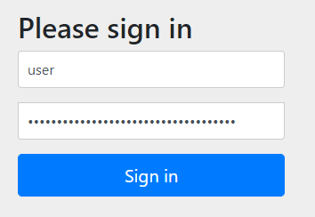
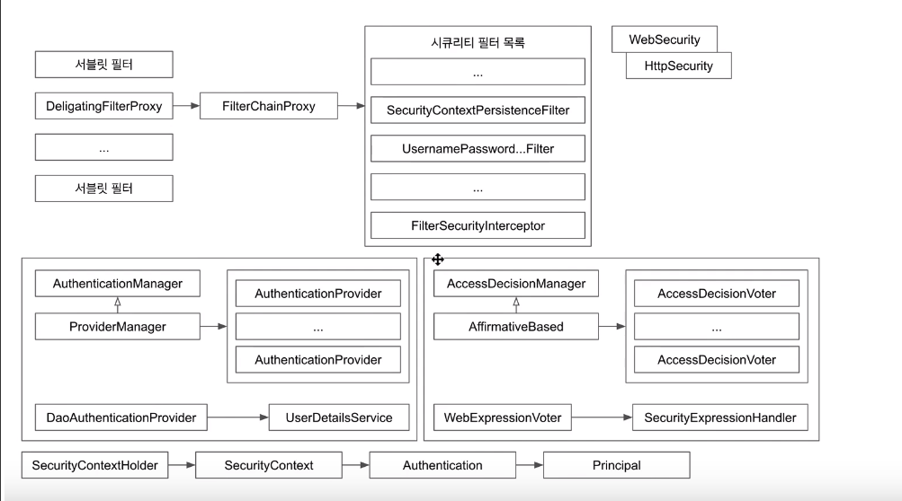
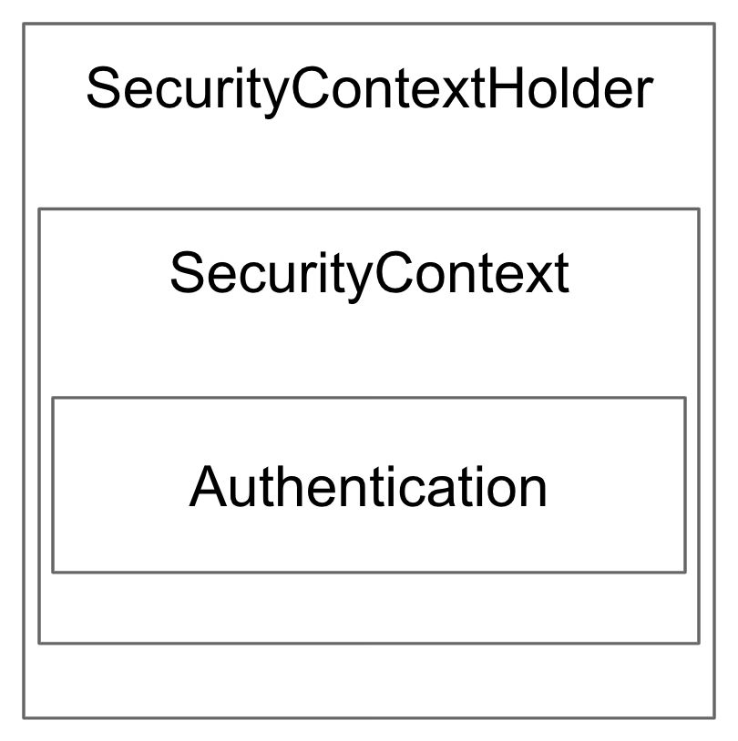
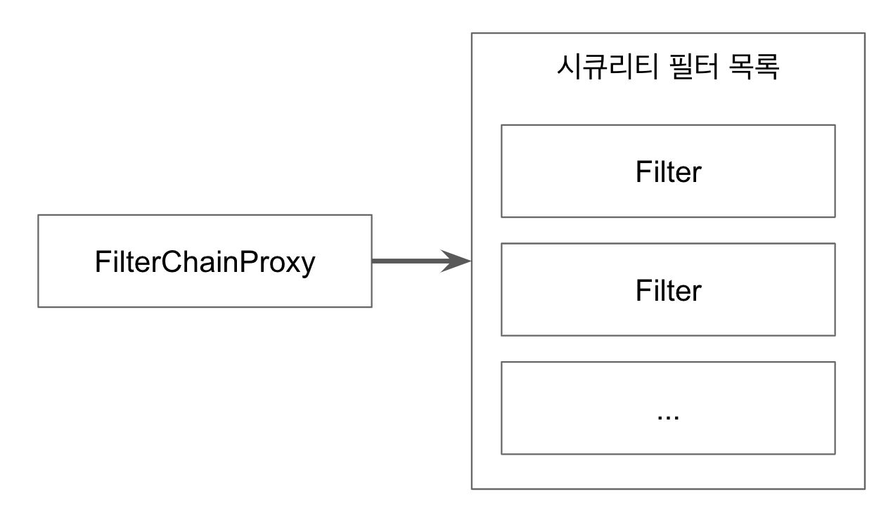

# Spring Security Study Repository
> 인프런 스프링 시큐리티 강좌를(백기선님) 학습하고 정리한 내용입니다.

# [섹션 0. 스프링 시큐리티: 폼 인증](#섹션-0.-스프링-시큐리티:-폼-인증)
* [스프링 웹 프로젝트 만들기](#스프링-웹-프로젝트-만들기)
* [스프링 시큐리티 연동](#스프링-시큐리티-연동)
* [스프링 시큐리티 설정하기](#스프링-시큐리티-설정하기)
* [스프링 시큐리티 커스터마이징: 인메모리 유저 추가](#스프링-시큐리티-커스터마이징:-인메모리-유저-추가)
* [스프링 시큐리티 커스터마이징: JPA 연동](#스프링-시큐리티-커스터마이징:-JPA-연동)
* [스프링 시큐리티 커스터마이징: PasswordEncoder](#스프링-시큐리티-커스터마이징:-PasswordEncoder)
* [스프링 시큐리티 테스트 1부](#스프링-시큐리티-테스트-1부)
* [스프링 시큐리티 테스트 2부](#스프링-시큐리티-테스트-2부)

# [섹션 1. 스프링 시큐리티: 아키텍처](#섹션-1.-스프링-시큐리티:-아키텍처)
* [SecurityContextHolder와 Authentication](#SecurityContextHolder와-Authentication)
* [AuthenticationManager와 Authentication](#AuthenticationManager와-Authentication)
* [ThreadLocal](#ThreadLocal)
* [Authentication과 SecurityContextHodler](#Authentication과-SecurityContextHodler)
* [스프링 시큐리티 필터와 FilterChainProxy](#스프링-시큐리티-필터와-FilterChainProxy)
* [DelegatingFilterProxy와 FilterChainProxy](#DelegatingFilterProxy와-FilterChainProxy)
* [AccessDecisionManager 1부](#AccessDecisionManager-1부)
* [AccessDecisionManager 2부](#AccessDecisionManager-2부)
* [FilterSecurityInterceptor](#FilterSecurityInterceptor)
* [ExceptionTranslationFilter](#ExceptionTranslationFilter)
* [스프링 시큐리티 아키텍처 정리](#스프링-시큐리티-아키텍처-정리)

# [섹션 2. 웹 애플리케이션 시큐리티](#섹션-2.-웹-애플리케이션-시큐리티)
* [스프링 시큐리티 ignoring() 1부](#스프링-시큐리티-ignoring()-1부)
* [스프링 시큐리티 ignoring() 2부](#스프링-시큐리티-ignoring()-2부)
* [Async 웹 MVC를 지원하는 필터: WebAsyncManagerIntegrationFilter](#Async-웹-MVC를-지원하는-필터:-WebAsyncManagerIntegrationFilter)
* [스프링 시큐리티와 @Async](#스프링-시큐리티와-@Async)
* [SecurityContext 영속화 필터: SecurityContextPersistenceFilter](#SecurityContext-영속화-필터:-SecurityContextPersistenceFilter)
* [시큐리티 관련 헤더 추가하는 필터: HeaderWriterFilter](#시큐리티-관련-헤더-추가하는-필터:-HeaderWriterFilter)
* [CSRF 어택 방지 필터: CsrfFilter](#CSRF-어택-방지-필터:-CsrfFilter)
* [CSRF 토큰 사용 예제](#CSRF-토큰-사용-예제)
* [로그아웃 처리 필터: LogoutFilter](#로그아웃-처리-필터:-LogoutFilter)
* [폼 인증 처리 필터: UsernamePasswordAuthenticationFilter](#폼-인증-처리-필터:-UsernamePasswordAuthenticationFilter)
* [로그인/로그아웃 폼 페이지 생성해주는 필터: DefaultLogin/LogoutPageGeneratingFilter](#로그인/로그아웃-폼-페이지-생성해주는-필터:-DefaultLogin/LogoutPageGeneratingFilter)
* [로그인/로그아웃 폼 커스터마이징](#로그인/로그아웃-폼-커스터마이징)
* [Basic 인증 처리 필터: BasicAuthenticationFilter](#Basic-인증-처리-필터:-BasicAuthenticationFilter)
* [요청 캐시 필터: RequestCacheAwareFilter](#요청-캐시-필터:-RequestCacheAwareFilter)
* [시큐리티 관련 서블릿 스팩 구현 필터: SecurityContextHolderAwareRequestFilter](#시큐리티-관련-서블릿-스팩-구현-필터:-SecurityContextHolderAwareRequestFilter)
* [익명 인증 필터: AnonymousAuthenticationFilter](#익명-인증-필터:-AnonymousAuthenticationFilter)
* [세션 관리 필터: SessionManagementFilter](#세션-관리-필터:-SessionManagementFilter)
* [인증/인가 예외 처리 필터: ExceptionTranslationFilter](#인증/인가-예외-처리-필터:-ExceptionTranslationFilter)
* [인가 처리 필터: FilterSecurityInterceptor](#인가-처리-필터:-FilterSecurityInterceptor)
* [토큰 기반 인증 필터 : RememberMeAuthenticationFilter](#토큰-기반-인증-필터-:-RememberMeAuthenticationFilter)
* [커스텀 필터 추가하기](#커스텀-필터-추가하기)

# [섹션 3. 스프링 시큐리티 그밖에](#섹션-3.-스프링-시큐리티-그밖에)
* [타임리프 스프링 시큐리티 확장팩](#타임리프-스프링-시큐리티-확장팩)
* [sec 네임스페이스](#sec-네임스페이스)
* [메소드 시큐리티](#메소드-시큐리티)
* [@AuthenticationPrincipal](#@AuthenticationPrincipal)
* [스프링 데이터 연동](#스프링-데이터-연동)
* [스프링 시큐리티 마무리](#스프링-시큐리티-마무리)
* [ 함께 학습하면 좋은 로드맵](#-함께-학습하면-좋은-로드맵)

# 섹션 0. 스프링 시큐리티: 폼 인증

## 스프링 시큐리티 연동

* 스프링 부트 환경에서 스프링 시큐리티 추가 방법 (maven)
    * ```maven
      <dependency>
            <groupId>org.springframework.boot</groupId>
            <artifactId>spring-boot-starter-security</artifactId>
        </dependency>
      ```


# 스프링 시큐리티의 의존성 추가 시 일어나는 일들
* 서버가 기동되면 스프링 시큐리티의 초기화 작업 및 보안 설정이 이루어진다
* 별도의 설정이나 구현을 하지 않아도 기본적인 웹 보안 기능이 현재 시스템에 연동되어 작동함
    1. `모든 요청은 인증이 되어야 자원에 접근이 가능하다`
    2. 인증 방식은 `폼 로그인` 방식과 `httpBasic 로그인` 방식을 제공한다
    3. 기본 로그인 페이지 제공한다 (/login)
    4. 기본 계정 한 개 제공한다 – username : user / password : 랜덤 문자열


> Using generated security password: __40f5bd88-a7f3-4d6f-916d-bfd7f142b9f8__

스프링 시큐리티가 기본적으로 제공하는 `계정`의 패스워드. 로그인 할 때 사용

> ID: __user__  
> password __40f5bd88-a7f3-4d6f-916d-bfd7f142b9f8__


`http://localhost:8080/login` 로 접속시 다음과 같이 사용



<br>
<br>


---

## 스프링 시큐리티 설정하기

스프링 시큐리티를 설정할 때는, 보통 `WebSecurityConfigurerAdapter` 를 상속 받은 configure 클래스를 새로 작성 한다.
```java
@Configuration
@EnableWebSecurity
public class SecurityConfig extends WebSecurityConfigurerAdapter {

    @Override
    protected void configure(HttpSecurity http) throws Exception {
        super.configure(http);
    }
}

```
* EnableWebSecurity : 웹 보안 활성 어노테이션
* 보통 WebSecurityConfigurerAdapter를 상속받은 메소드들을 오버라이딩 하는 방식으로 설정한다.
```java
@Override
    protected void configure(HttpSecurity http) throws Exception {
        // ex) 루트로 오는 요청과 info로 오는 요청은 인증을 거치지 않아도 상관 없다는 설정
        http.authorizeRequests()
                .mvcMatchers("/", "/info").permitAll();
    }

```

* anyRequest() : 기타 등등한 요청에 대하여 설정 
* formLogin() : 폼 로그인을 사용할 것이다
* and() : 메서드 체이닝을 이용해서 연속으로 설정
  
## 스프링 시큐리티 커스터마이징: 인메모리 유저 추가

* `UserDetailsServiceAutoConfiguration` 클래스
  * 이 클래스를 열어보면 우리가 어떻게 커스텀 할지 힌트를 얻을 수 있다.
  * `inMemoryUserDetailsManager()` 메소드에서 `SecurityProperties`객체를 인자로 받는다
  * `SecurityProperties` 클래스안에 `User` 클래스가 있고, 이 클래스가 기본적인 인증을 위해 필요한 변수 등을 보여주는 틀이다. 

* application.properties 파일에서 기본으로 제공되는 아이디의 유저명, 패스워드, 권한을 설정할 수 있다.
  * ```properties
    spring.security.user.name=admin
    spring.security.user.password=123
    spring.security.user.roles=ADMIN
    ```  
  
  * 설정 하게 되면 자동으로 설정되는 password를 쓰지 않기 때문에 콘솔에 비밀번호가 출력이 되지 않는다. 
  * 안전하지 않고 권장하지 않는다. 

* `AuthenticationManagerBuilder`를 인자로 받는 `configure` 메서드 
  * 이것을 사용하면 우리가 원하는 유저를 만들어서 인메모리 방식으로 설정할 수 있다. 

```java
// WebSecurityConfigurerAdapter를 상속받은 SpringSecurity 클래스 내 `메서드 `

@Override
    protected void configure(AuthenticationManagerBuilder auth) throws Exception {
        auth.inMemoryAuthentication()
                .withUser("youngsoo").password("{noop}123").roles("USER").and()
                .withUser("keesun").password("{noop}123").roles("USER").and()
                .withUser("admin").password("{noop}!@#").roles("ADMIN");
    }

```
* {} : 패스워드 앞에 붙여 사용하는 패스워드 인코더. 
* {noop} : noop은 암호화를 하지 않았다는것.
  * [참고!!](https://java.ihoney.pe.kr/498)  
  * PasswordEncoderFactories클래스의 
  * createDelegatingPasswordEncoder에 정의되어 있는 PasswordEncoder 종류를 보자 
  * 
## 스프링 시큐리티 커스터마이징: JPA 연동

* JPA 의존성 추가
```MAVEN
<dependency>
    <groupId>org.springframework.boot</groupId>
    <artifactId>spring-boot-starter-data-jpa</artifactId>
</dependency>
```
* h2 추가 
```
<dependency>
    <groupId>com.h2database</groupId>
    <artifactId>h2</artifactId>
</dependency>
```

```java
@Service
@RequiredArgsConstructor
public class AccountService implements UserDetailsService {

    private final AccountRepository accountRepository;

    @Override
    public UserDetails loadUserByUsername(String s) throws UsernameNotFoundException {

        Account account = accountRepository.findByUsername(s);

        if (account == null) {
            throw new UsernameNotFoundException(s);
        }

        return User.builder()
                .username(account.getUsername())
                .password(account.getPassword())
                .roles(account.getRole())
                .build();
    }

}
```

* UserDetailService 인터페이스
  * DAO를 가지고 와서 유저 정보를 인증하는데 쓰인다 
  * username을 으로 해당하는 정보를 가져와서 UserDetails로 리턴하는것.   
  * 스프링 시큐리티의 `User` 클래스의 Builder를 이용해서 UserDetails를 만들 수 있다. 


# UserDetailService에 인증 정보 등록하는법 
## 명시적으로 Security Config에 정의하는법

* 1. UserDetailsService를 구현한 Service클래스를 정의
```java
@Service
@RequiredArgsConstructor
public class AccountService implements UserDetailsService {

    private final AccountRepository accountRepository;

    @Override
    public UserDetails loadUserByUsername(String s) throws UsernameNotFoundException {

        Account account = accountRepository.findByUsername(s);

        if (account == null) {
            throw new UsernameNotFoundException(s);
        }

        return User.builder()
                .username(account.getUsername())
                .password(account.getPassword())
                .roles(account.getRole())
                .build();
    }
    ... 생략
}
```

* 2. Security Config의 AuthenticationManagerBuilder 인자를 받는 configure 메소드에서 서비스를 등록
```java

@Configuration
@EnableWebSecurity
public class SecurityConfig extends WebSecurityConfigurerAdapter {

    @Autowired
    AccountService accountService;

    ... 생략

    @Override
    protected void configure(AuthenticationManagerBuilder auth) throws Exception {
        auth.userDetailsService(accountService);

    }
}

```

> 명시적으로 AuthenticationManagerBuilder에 등록하지 않아도  
> UserDetailsService 타입의 Bean으로 등록만 되있으면 알아서 가져다 쓴다.  
> PasswordEncorder도 마찬가지. 

<br>

## 스프링 시큐리티 커스터마이징: PasswordEncoder

> # 비밀번호는 평문이 아닌 단방향 알고리즘으로 인코딩해서 저장해야 한다

회원가입을 하는 과정에 패스워드를 암호화 하는데  

보통 `PasswordEncoder`를 Bean으로 등록하고 서비스나 도메인 계층에서 비밀번호를 암호화 한다.

* 스프링 시큐리티5에서 권장하는 PassowrdEncoder
* PasswordEncoderFactories.createDelegatingPasswordEncoder()
 
* 다양한 패스워드 인코딩을 지원한다. 
  
* # Password Encoder 종류
    * BCryptPasswordEncoder
    * NoOpPasswordEncoder
    * Pbkdf2PasswordEncoder
    * ScryptPasswordEncoder
    * StandardPasswordEncoder
 
```java
 @Bean
 public PasswordEncoder passwordEncoder() {
     return PasswordEncoderFactories createDelegatingPasswordEncoder();
 }
```

## 스프링 시큐리티 테스트 1부

## `이 강좌에서는 JUnit4 기반으로 테스트를 작성!!!`

* https://docs.spring.io/spring-security/site/docs/5.1.5.RELEASE/reference/htmlsingle/#test-mockmvc

* Spring-Security-Test 의존성 추가
  ```java
  <dependency>
    <groupId>org.springframework.security</groupId>
    <artifactId>spring-security-test</artifactId>
    <scope>test</scope>
  </dependency>
  ```
  *  테스트에서 사용할 기능을 제공하기 때문에 Test 스콥이 적절

@AutoConfigureMockMvc 를 사용하면 MockMvc 테스트를 진행할 수 있다

```java
@RunWith(SpringRunner.class)
@SpringBootTest
@AutoConfigureMockMvc
public class SpringBootTest {
    @Test
    public void index_user() throws Exception {
        mockMvc.perform(get("/")
                .with(user("youngsoo").roles("USER")))// 이러한 가짜 유저가 있다 하고 요청을 보내는것
                .andDo(print())
                .andExpect(status().isOk());

    }
}
```
* with(user("name").roles("USER)) 
  * 가짜 유저를 mocking 하여 요청을 한다.  
```java
 @Test
public void admin_user() throws Exception {
    mockMvc.perform(get("/admin")
            .with(user("youngsoo").roles("USER")))// 이러한 가짜 유저가 있다 하고 요청을 보내는것
            .andDo(print())
            .andExpect(status().isForbidden());
}
```
* USER 권한을 가진 유저가 admin에 접근하면 foridden 응답이 온다.
  
<br>

## 어나니머스 유저가 접근할 때 사용하는 어노테이션 `@WithAnonymousUser`

```java
@Test
@WithAnonymousUser
public void index_anonymous() throws Exception {
    mockMvc.perform(get("/"))
            .andDo(print())
            .andExpect(status().isOk());
}
```
<br>

## 유저를 직접 설정(Mocking)하여 유저 접근
```java
@Test
@WithMockUser(username = "youngsoo", roles = "USER")
public void index_user_youngsoo() throws Exception {
    mockMvc.perform(get("/"))
            .andDo(print())
            .andExpect(status().isOk());
}
```
* `@WithMockUser()` 어노테이션 
    * username, roles, authorities, password 등 설정 가능 

## 직접 어노테이션을 커스텀 할 수도 있다.

```java
@Retention(RetentionPolicy.RUNTIME)
@WithMockUser(username = "youngsoo", roles = "USER")
public @interface WithUser {
}
```

> 다음과 같이 사용할 수 있다. 
```java
@Test
@WithUser // <<<
public void index_user_youngsoo() throws Exception {
... 
}
```
---
# 스프링 시큐리티 테스트 2부

# 폼 로그인 테스트 방법
```java
@Transactional
@Test
public void login() throws Exception {
    String username = "youngsoo";
    String password = "123";
    
    Account user = createUser(username, password);
    mockMvc.perform(formLogin().user(user.getUsername()).password(password))
            .andExpect(authenticated());
}

private Account createUser(String username, String password) {
    Account account = new Account();
    account.setUsername(username);
    account.setPassword(password);
    account.setRole("USER");
    return accountService.createNew(account);
}

```

* 레포지토리에 Account를 생성하고 formLogin() 메서드를 이용하여 인증하면  
  authenticated()로 인증 결과를 알 수 있다. 

* 인증에 실패하는걸 확인하려면 `unauthenticated()`를 이용하면 된다. 

---

# 섹션 1. 스프링 시큐리티: 아키텍처

1. 웹으로부터 요청이 들어오면 서블릿 필터 중 DeligatingFilterProxy 를 통해 들어온다.

  (DeligatingFilterProxy 는 스프링부트를 사용할 때 자동적으로 등록된다)

2. 1번에서 특정한 Bean (SpringSecurityFilterChain) 에 필터 기능을 위임하여 스프링 시큐리티에

   내장된 15가지 필터들을 사용하게 된다. (FilterChainProxy 를 통해)

3. 2번의 체인의 필터들은 WebScurity, HttpSecurity 를 사용하면서 만들어진다.
   WebSecurityConfigurerAdater 를 상속하는 SecurityConfig 파일에서 우리 프로젝트에 맞는

   security 설정을 해주면 내장된 필터들에 설정들이 자동적으로 반영된다.


--- 
> # Authentication (인증)
> # Authorization (인가)

## SecurityContextHolder와 Authentication
https://docs.spring.io/spring-security/site/docs/5.1.5.RELEASE/reference/htmlsingle/#core-components


* ## SecurityContextHolder
  - SecurityContext 제공, 기본적으로 ThreadLocal을 사용한다.
  - ThreadLocal : 한 쓰레드 내에서 share 하는 저장소
  - 
* ## SecurityContext
  - Authentication 제공.  

> 우리가 어떤 애플리케이션에서 인증을 거치고 나면 그 인증된 사용자 정보를 Principal 이라고 하는데,  
> 이 Principal 정보를 Authentication 이라는 객체에 `담아서` 관리를 하고,  
> Authentication는 SecurityContext에, SecurityContext는 SecurityContextHolder로 감싸져 있다. 

## 범위 : `SecurityContextHolder(SecurityContext[Authentication])`



## Authentication -(인증 객체)
- `Principal`과 `GrantAuthority` 제공.
- SecurityContextHolder.getContext().getAuthentication(); 로 꺼낼 수 있다

## Principal - (누구 객체 )
- “누구"에 해당하는 정보.
- 객체는 `UserDetails 타입`. 
  - authentication.getPrincipal() 메서드로 꺼내면 `Object` 타입이지만,  
    사실은 `UserDetails`, `User` 타입이다.  
- authentication.getPrincipal()로 꺼낼 수 있다.
- UserDetailsService를 구현한 서비스에서 리턴한 객체

```java
@Service
public class AccountService implements UserDetailsService {

    @Override
    public UserDetails loadUserByUsername(String s) throws UsernameNotFoundException {
        //.... 생략
    }
}

@Configuration
@EnableWebSecurity
public class SecurityConfig extends WebSecurityConfigurerAdapter {

    @Autowired AccountService accountService;

    @Override
    protected void configure(AuthenticationManagerBuilder auth) throws Exception {
        auth.userDetailsService(accountService); // << 여기서 리턴한 객체 
    }
}
```

## GrantAuthority - (권한 객체)
- “ROLE_USER”, “ROLE_ADMIN”등 Principal이 가지고 있는 “권한”을 나타낸다.
- 인증 이후, 인가 및 권한 확인할 때 이 정보를 참조한다.
- 권한은 여러가지를 가질 수 있다.

## UserDetails 
- 애플리케이션이 가지고 있는 유저 정보와 스프링 시큐리티가 사용하는 Authentication 객체 사이의 어댑터.

## UserDetailsService
- 유저 정보를 UserDetails 타입으로 가져오는 DAO (Data Access Object) 인터페이스.
- 유저 정보를 UserDetails 타입으로 가져오는 DAO (Data Access Object) 인터페이스.

* ##  폼을 통하여 로그인 할때 들어오는 정보를 디버그 하면 다음과 같다

```
// authentication 객체
authentication = "UsernamePasswordAuthenticationToken" 
 - Principal= org.springframework.security.core.userdetails.User 
 - credentials = null
 - authorities = {Collections$UnmodifiableRandomAccessList@10828}  size = 1
 - details = {WebAuthenticationDetails@10833} 
 - authenticated = true

// principal 객체 
principal ="org.springframework.security.core.userdetails.User" 
 - password = null
 - username = "youngsoo"
 - authorities = {Collections$UnmodifiableSet@10854}  size = 1
 - accountNonExpired = true
 - accountNonLocked = true
 - credentialsNonExpired = true
 - enabled = true
 
// authroites
authorities = {Collections$UnmodifiableRandomAccessList@10713}  size = 1
 - 0 = {SimpleGrantedAuthority@10871} "ROLE_USER"
 - role = "ROLE_USER"
```

> 객체 이름은 = , 멤버 필드는 -

--- 

## AuthenticationManager와 Authentication
### 스프링 시큐리티에서 인증(Authentication)은 `AuthenticationManager`가 한다
- ` AuthenticationManager가 Authentication 객체를 만들고 인증을 처리한다.`
  
- AuthenticationManager : 인터페이스 
- AuthenticationManager는 authenticate 메서드 하나밖에 없다.

> Authentication authenticate(Authentication authentication) throws AuthenticationException;

* 인자로 받은 Authentication​이 `​유효한 인증인지 확인​`하고 `​Authentication 객체를 리턴​`한다.
 
* 인증을 확인하는 과정에서 비활성 계정, 잘못된 비번, 잠긴 계정 등의 에러를 던질 수 있다

- AuthenticationManager 인터페이스를 구현하는 객체 
  - ProviderManager
  - 또는 AuthenticationManager 구현
  - AuthenticationManager 직접 구현할 필요는 없지만,  
    ProviderManager 클래스를 보면서 어떻게 인증이 이루어지는지 알 수 있다.

<br>

## > 인자로 받은 Authentication
* 사용자가 입력한 인증에 필요한 정보(username, password)로 만든 객체. (폼 인증인 경우)

* Authentication
    * Principal: “keesun”
    * Credentials: “123”
## > 유효한 인증인지 확인

* 사용자가 입력한 password가 UserDetailsService를 통해 읽어온 UserDetails 객체에 들어있는 password와 일치하는지 확인

* 해당 사용자 계정이 잠겨 있진 않은지, 비활성 계정은 아닌지 등 확인

## > Authentication 객체를 리턴
* Authentication
    * Principal: UserDetailsService에서 리턴한 그 객체 (User)
    * Credentials:
    * GrantedAuthorities

## > 폼 로그인을 한다면, 인증이 일어나는 순서

-> AuthenticationManager를 구현한 ProviderManager가 인증 수행

1. ProviderManager.authenticate(Authentication `authentication`) 메소드 내에서 인증 수행 
   *  인자로 받은 authentication은 우리가 폼에서 입력한 정보   
      (UsernamePasswordAuthenticationToken)

2.  authentication 인증 객체는 Provider가 처리하는데, 
    ProviderManager가 가진 `List<AuthenticationProvider> providers` 중에  
    현재 인증 객체를 처리 할 수 있는 Provider가 없으면 parent로 간다.  
    (다른 Provider가 처리할 수 있게, 링크드 리스트 처럼 연결)
    ```java
    if (result == null && this.parent != null) {        
        result = this.parent.authenticate(authentication);
    ```
3. parent Provider에서 다시 인증 할 수 있는지 확인한다. (다른 Provider 클래스)
4. 다른 Provider가 인증을 처리 할 수 있다면, UserDetails서비스를 사용해서 인증한다.  
   * AbstractUserDetailsAuthenticationProvider.authenticate() 메서드 

5. 캐시된 유저가 있나 등을 확인하고, retrieveUser() 메서드를 호출하여 Provider 안으로 들어간다.(예제는 DaoAuthenticationProvider)
6. 이 Provider의 `protected final UserDetails retrieveUser` 메소드에서   
   사용하는 UserDetailsService가 우리가 만든 UserDetailsService를 구현한 AccountService 이다 
```java
// DaoAuthenticationProvider 클래스의 retrieveUser 메서드
 protected final UserDetails retrieveUser(String username, 
                                          UsernamePasswordAuthenticationToken authentication) 
                                          throws AuthenticationException {
    this.prepareTimingAttackProtection();
    try {
        UserDetails loadedUser = this.getUserDetailsService().loadUserByUsername(username); // <<<<
        if (loadedUser == null) {
            throw new InternalAuthenticationServiceException("UserDetailsService returned null, 
                                                             which is an interface contract violation");
        } else {
            return loadedUser;
        }
    }
}
```

7. 이후 추가적인 체크를 한다 (계정이 lock인지 등)
8. 무사히 다 통과한다면 result 라는 `authentication 객체`를 리턴하는데,  
   이 `authentication 객체`가 우리가 UserDetailsService를 구현한 구현체인  
   AccountService에서 loadUserByUsername 메서드의 리턴값인 `UserDetails`이다. 
   *  이 `UserDetails` 객체 가 Authencation 안에 들어가는 `principal`객체이다

> ProviderManager의 authenticate 메서드에서 리턴한 result 객체가 인증이 되면,   
> principal이 되어 authentication 객체가 되고  
> SecurityContextHolder.getContext().getAuthentication 으로 꺼낼 수 있게 된다.   

---
## ThreadLocal

Java.lang 패키지에서 제공하는 쓰레드 범위 변수. 즉, 쓰레드 수준의 데이터 저장소.
* 같은 쓰레드 내에서만 공유.

* 따라서 같은 쓰레드라면 해당 데이터를 메소드 매개변수로 넘겨줄 필요 없이 get으로 꺼낼 수 있따. 
  
* `SecurityContextHolder의 기본 전략.`
    * SecurityContext를 ThreadLocal에 갖고 있어서 공유가 가능하다. 

```java
public class AccountContext {
    private static final ThreadLocal<Account> ACCOUNT_THREAD_LOCAL = new ThreadLocal<>();

    public static void setAccount(Account account) {
        ACCOUNT_THREAD_LOCAL.set(account);
    }
    public static Account getAccount() {
        return ACCOUNT_THREAD_LOCAL.get();
    }
}
```

AccountContext.getAccount()로 어디서든 꺼낼 수 있다. 

---

## Authentication과 SecurityContextHodler

AuthenticationManager가 인증을 마친 뒤 리턴 받은 Authentication 객체의 행방은??

-> SecurityContextHolder에 들어가서 애플리케이션 전반에 사용할 수 있게 된다. 

`UsernamePasswordAuthenticationFilter` 와   
`SecurityContextPersisenceFilter` 가  
Authentication을 SecurityContextHold에 넣어준다. 


### UsernamePasswordAuthenticationFilter
* 폼 인증을 처리하는 시큐리티 필터
* 인증된 Authentication 객체를 SecurityContextHolder에 넣어주는 필터
  
* SecurityContextHolder.getContext().setAuthentication(authentication)


### SecurityContextPersisenceFilter
* SecurityContext를 HTTP session에 캐시(기본 전략)하여 여러 요청에서 Authentication을 공유하는 필터.
  
* SecurityContextRepository를 교체하여 세션을 HTTP session이 아닌 다른 곳에 저장하는
것도 가능하다.
  * HttpSession이 날라가면 저장되었떤 인증 정보도 날라간다. 

AuthenticationManager를 사용하는 부분은 UsernamePasswordAuthenticationFilter이다.
UsernamePasswordAuthenticationFilter에서 Authentication 객체를  SecurityContextHolder에 넣는다. 

UsernamePasswordAuthenticationFilter에서 인증이 이루어지고   
SecurityContextHolder에 authentication이 저장이 되고 SecurityContextPersitenceFilter에서 Http session에 authentictication을 캐시한다

---

## 스프링 시큐리티 필터와 FilterChainProxy
* 스프링 시큐리티가 제공하는 필터들 - 클릭해서 조회
  1. [WebAsyncManagerIntegrationFilter](#Async-웹-MVC를-지원하는-필터:-WebAsyncManagerIntegrationFilter)
  2. [`SecurityContextPersistenceFilter`](#SecurityContext-영속화-필터:-SecurityContextPersistenceFilter) < 
  3. [HeaderWriterFilter](#시큐리티-관련-헤더-추가하는-필터:-HeaderWriterFilter)
  4. [CsrfFilter](#CSRF-어택-방지-필터:-CsrfFilter)
  5. [LogoutFilter](#로그아웃-처리-필터:-LogoutFilter)
  6. [`UsernamePasswordAuthenticationFilter`](#폼-인증-처리-필터:-UsernamePasswordAuthenticationFilter) <
  7. [DefaultLoginPageGeneratingFilter](#로그인/로그아웃-폼-페이지-생성해주는-필터:-DefaultLogin/LogoutPageGeneratingFilter)
  8. [DefaultLogoutPageGeneratingFilter](#로그인/로그아웃-폼-페이지-생성해주는-필터:-DefaultLogin/LogoutPageGeneratingFilter)
  9. [BasicAuthenticationFilter](#Basic-인증-처리-필터:-BasicAuthenticationFilter)
  10. [RequestCacheAwareFilter](#요청-캐시-필터:-RequestCacheAwareFilter)
  11. [SecurityContextHolderAwareRequestFilter](#시큐리티-관련-서블릿-스팩-구현-필터:-SecurityContextHolderAwareRequestFilter)
  12. [AnonymousAuthenticationFilter](#익명-인증-필터:-AnonymousAuthenticationFilter)
  13. [SessionManagementFilter](#세션-관리-필터:-SessionManagementFilter)
  14. [ExceptionTranslationFilter](#ExceptionTranslationFilter)
  15. [FilterSecurityInterceptor](#FilterSecurityInterceptor)

이 모든 필터는 ​FilterChainProxy​클래스가 호출한다.


* 필터 목록을 선택할 때 SeicurityFilterChain이라는 목록에서 선택한다. 

```java
public class FilterChainProxy extends GenericFilterBean {
   ... 생략
   private List<Filter> getFilters(HttpServletRequest request) { // filter 목록 가져오기
    for (SecurityFilterChain chain : filterChains) {
        if (chain.matches(request)) {
            return chain.getFilters();
        }
    }
    return null;
    } 
   ... 생략
}
```
* filter의 목록을 가져오는 getFilters()

* filter 목록의 구성은 public class SecurityConfig extends 
  WebSecurityConfigurerAdapter

a. WebSecurityConfigurerAdapter 상속 객체가 여럿일 때 @Order
b. http.antMatcher()


## DelegatingFilterProxy와 FilterChainProxy

## AccessDecisionManager 1부

## AccessDecisionManager 2부

## FilterSecurityInterceptor

## ExceptionTranslationFilter

## 스프링 시큐리티 아키텍처 정리

# 섹션 2. 웹 애플리케이션 시큐리티

## 스프링 시큐리티 ignoring() 1부

## 스프링 시큐리티 ignoring() 2부

## Async 웹 MVC를 지원하는 필터: WebAsyncManagerIntegrationFilter

## 스프링 시큐리티와 @Async

## SecurityContext 영속화 필터: SecurityContextPersistenceFilter

## 시큐리티 관련 헤더 추가하는 필터: HeaderWriterFilter

## CSRF 어택 방지 필터: CsrfFilter

## CSRF 토큰 사용 예제

## 로그아웃 처리 필터: LogoutFilter

## 폼 인증 처리 필터: UsernamePasswordAuthenticationFilter

## 로그인/로그아웃 폼 페이지 생성해주는 필터: DefaultLogin/LogoutPageGeneratingFilter

## 로그인/로그아웃 폼 커스터마이징

## Basic 인증 처리 필터: BasicAuthenticationFilter

## 요청 캐시 필터: RequestCacheAwareFilter

## 시큐리티 관련 서블릿 스팩 구현 필터: SecurityContextHolderAwareRequestFilter

## 익명 인증 필터: AnonymousAuthenticationFilter

## 세션 관리 필터: SessionManagementFilter

## 인증/인가 예외 처리 필터: ExceptionTranslationFilter

## 인가 처리 필터: FilterSecurityInterceptor

## 토큰 기반 인증 필터 : RememberMeAuthenticationFilter

## 커스텀 필터 추가하기

# 섹션 3. 스프링 시큐리티 그밖에

## 타임리프 스프링 시큐리티 확장팩

## sec 네임스페이스

## 메소드 시큐리티

## @AuthenticationPrincipal

## 스프링 데이터 연동

## 스프링 시큐리티 마무리
